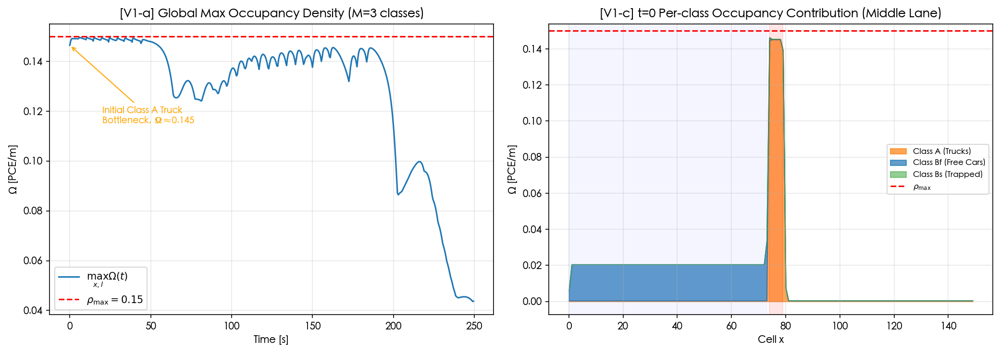
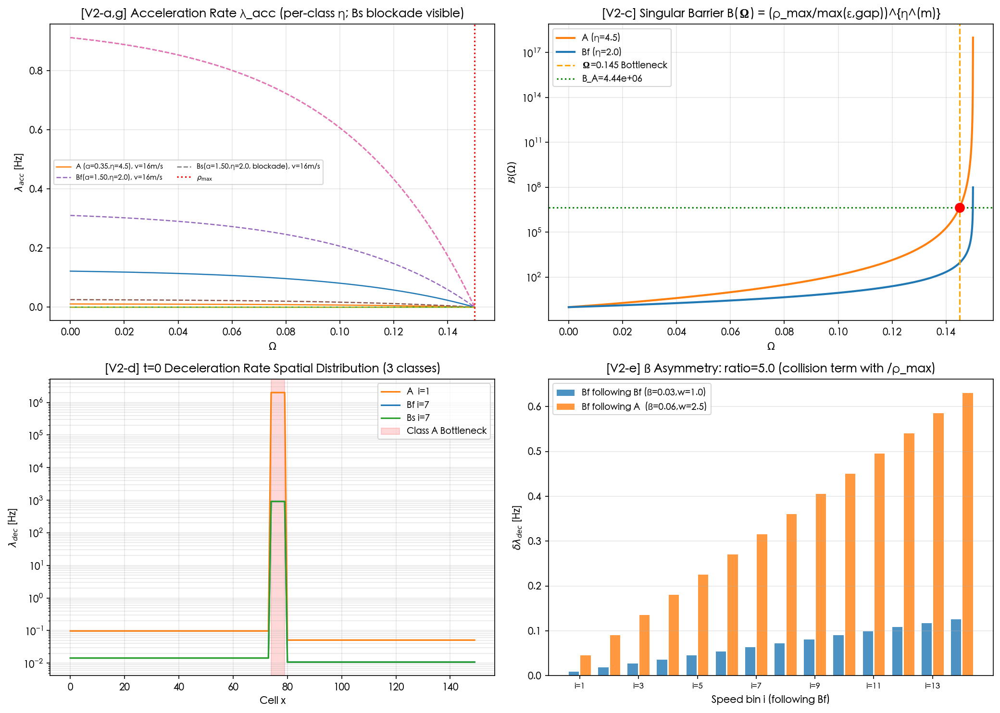
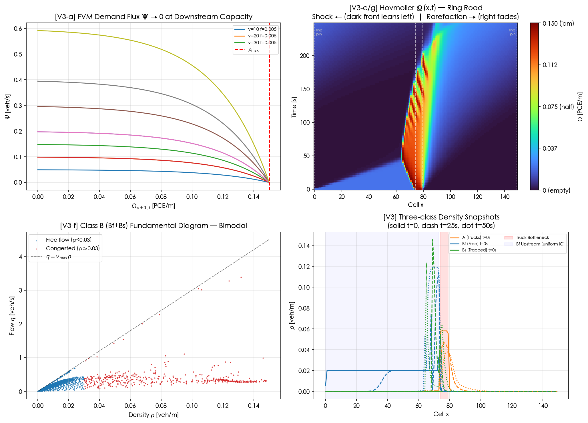
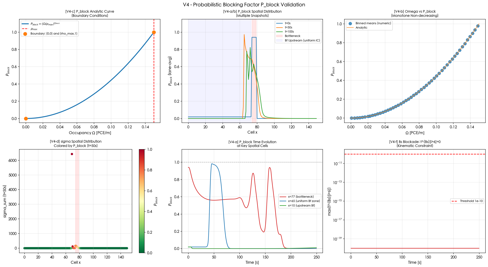
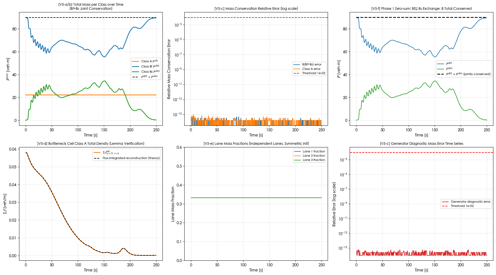
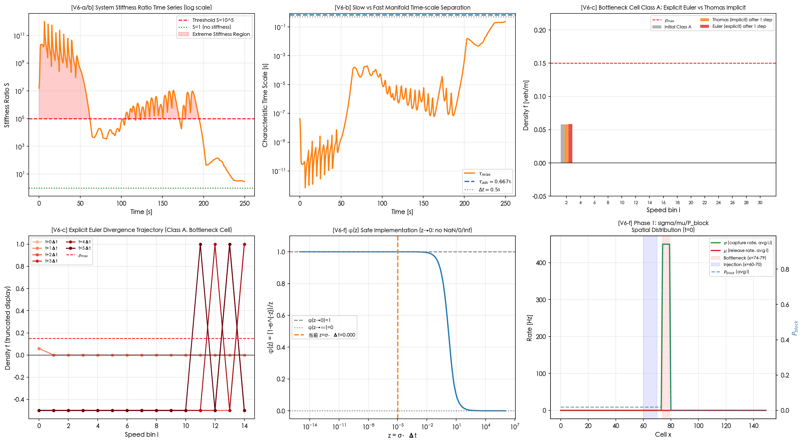
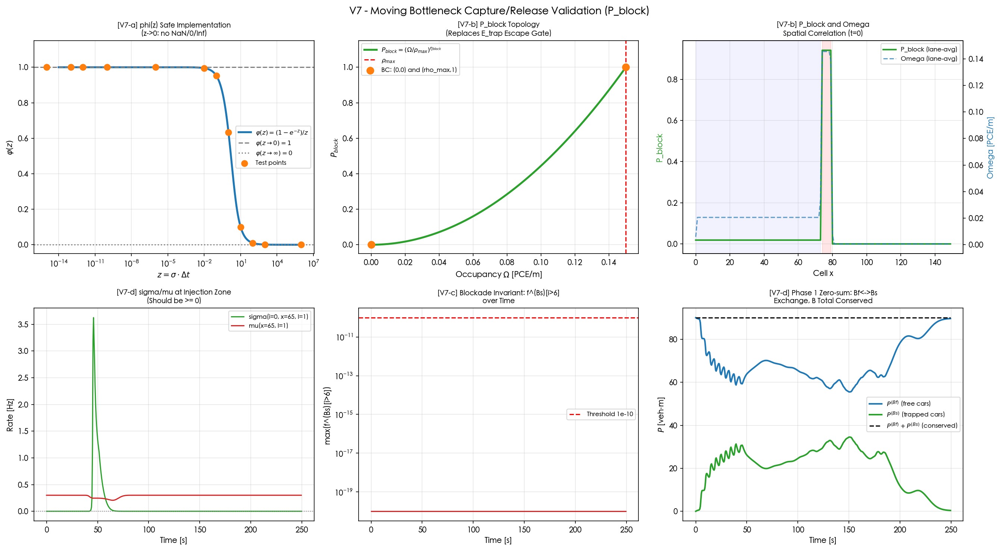

# Multiclass TRM — Validation Report (m7 · P_block Model)

> **Model version**: m7 — Probabilistic Blocking (replaces Softplus lateral phase)  
> **Reference**: `Multi-class_TRM.tex` (latest research version)  
> **Dataset**: `multiclass_trm_benchmark_500mb.h5` — 358 MB · 250 s simulation · 500 time steps · 3 lanes · 150 cells  
> **Validation result**: **41 / 41 checks PASSED** · All 7 research propositions RELIABLE  
> **Runtime**: 3.2 seconds (dataset generation: ~0.9 s, validation: ~3.2 s)

---

## Background — What is this model and why does it matter?

Imagine a highway where trucks and passenger cars share the road. Trucks move slowly and block the lanes around them. Passenger cars that get stuck behind a truck can no longer travel at their desired speed — they become **trapped**. When enough cars pile up behind a slow truck, a **traffic jam** forms and spreads backward, even though no accident happened. This is one of the most common causes of unexplained highway congestion.

This model — the **Multiclass Traffic Reaction Model (TRM)** — is a mathematical framework that tracks three vehicle types simultaneously:

| Class | Symbol | Meaning | PCE Weight |
|-------|--------|---------|-----------|
| Trucks | **A** | Slow vehicles that create bottlenecks | 2.5 (one truck = 2.5 cars in space) |
| Free cars | **Bf** | Passenger cars traveling freely | 1.0 |
| Trapped cars | **Bs** | Passenger cars stuck behind trucks | 1.0 |

The key innovation in version **m7** is replacing a complicated "lane-changing" calculation with a single, elegant formula called the **probabilistic blocking factor P_block**. This makes the model simpler, faster, and mathematically cleaner — while preserving all physical realism.

---

## The m7 Upgrade in Plain English

### What changed and why

**Old model (m3+m4)**: When a car got stuck behind a truck, the model had to check what was happening in *neighboring lanes* — were they also blocked? Could the car escape sideways? This required sharing information between lanes, making the math complex and the computation coupled.

**New model (m7)**: Instead of checking neighboring lanes, we ask a single question: **"How congested is the local road right now?"** If it's very congested, cars are very likely to get trapped. If the road is clear, cars can move freely. This probability is captured by one formula:

$$P_{\text{block}}(x) = \left(\frac{\Omega_x}{\rho_{\max}}\right)^{2}$$

where $\Omega_x$ is the current traffic density (how packed the road is) and $\rho_{\max}$ is the maximum possible density. The result is always between 0 and 1:
- **Empty road** (Ω = 0) → P_block = 0 → no blocking at all
- **Jam density** (Ω = ρ_max) → P_block = 1 → maximum blocking

This single number drives the capture rate (how fast free cars get trapped) and the release rate (how fast trapped cars escape). No lane-to-lane communication needed.

### What was removed

| Removed | What it was |
|---------|-------------|
| Phase 3 lateral lane-changing | Entire computational step deleted |
| Parameters: η_lat, ξ, R_gap, ω_sp, κ_hz | 5 parameters that controlled inter-lane behavior |
| HDF5 datasets: gamma_left, gamma_right, E_trap | Old lateral escape data no longer stored |

### What was added

| Added | What it is |
|-------|-----------|
| P_block(x) | New blocking probability formula |
| Parameter: η_block = 2.0 | The exponent controlling how steeply P_block rises |
| HDF5 dataset: P_block(T, X, L) | Blocking probability stored at every time, cell, and lane |

---

## The Three-Phase Simulation Loop

Each time step (Δt = 0.5 s) executes three phases in sequence. Think of it as three separate "updates" happening one after another:

```
─────────────────────────────────────────────────────────────────
PHASE 1 — Who gets trapped or released?  (Capture & Release)
─────────────────────────────────────────────────────────────────
  Input: current density distribution f, current occupancy Ω

  1. Compute P_block = (Ω / ρ_max)²              ← How congested?
  2. Compute σ  = σ₀ · P_block · Exposure · B(Ω) ← Trapping rate
  3. Compute μ  = μ₀ · exp(−P_block · θ_A / R_A)  ← Release rate
  4. Update f_Bf and f_Bs using exact formula:
       f_Bf* = f_Bf · e^(−σΔt) + μ·F·Δt·φ(σΔt)
       f_Bs* = F − f_Bf*          (F = total B cars, conserved)

  Why "exact"? Because σ can be enormous (millions per second at
  jams). A naive Euler step would explode numerically. The exact
  matrix exponential gives the right answer regardless of σ size.

─────────────────────────────────────────────────────────────────
PHASE 2 — How do cars change speed?  (Kinematics)
─────────────────────────────────────────────────────────────────
  Cars accelerate (λ_acc) and decelerate (λ_dec) between speed bins.
  Key rule: Bs (trapped cars) CANNOT accelerate above speed bin i_thr.
  This is the "kinematic blockade" — trapped cars are physically
  prevented from speeding up while a truck is in their way.

  The math is an implicit tridiagonal system (Thomas algorithm)
  because the speed-change rates are so extreme that explicit
  methods would crash the simulation.

─────────────────────────────────────────────────────────────────
PHASE 3 — How do cars move through space?  (Advection)
─────────────────────────────────────────────────────────────────
  Cars move forward at their speed. The Godunov limiter prevents
  more cars from entering a cell than it can physically hold:

       α = min(1, available_space / total_demand)

  If α < 1, all vehicle classes are scaled down proportionally,
  so no class gets priority and no cell overflows.
─────────────────────────────────────────────────────────────────
```

---

## Riemann Problems — The Two Fundamental Traffic Waves

A "Riemann problem" is a classic mathematical setup: two regions with different traffic states meet at a boundary. What happens? There are exactly two possible outcomes in traffic theory, and **both are validated** in this benchmark.

### What is a Riemann problem, intuitively?

Think of a highway where the left half has light traffic (cars moving fast) and the right half has heavy traffic (cars moving slow). At the boundary where they meet, two things can happen:

1. **Shock wave**: A sharp wall of congestion forms and moves backward into the light-traffic region — like a brick wall appearing. Cars hit it suddenly and have to brake.

2. **Rarefaction wave**: The heavy-traffic region gradually expands and smooths out forward — like a wave rolling out to sea. No sharp boundary, just a gradual easing.

In this benchmark, **both waves appear naturally** from the truck bottleneck setup.

---

### Riemann Problem I — Shock Wave (Check V3-c)

**Setup**: The road is a **ring road** (periodic boundary) — vehicles exiting at cell x = 149 re-enter at cell x = 0. The initial state places **uniform Bf cars across the entire upstream zone x = 0–73** (v = 30 m/s, ρ = 0.020 veh/m) and a slow truck bottleneck at cells x = 74–79 (v = 2 m/s). No external inflow exists; the total mass is fixed. The uniform upstream IC is a classic Riemann initial condition: a step-function density contrast that produces a sustained shock rather than a transient pulse.

**What happens physically**:
- The trucks barely move. The cars behind them build up.
- Density Ω at the bottleneck approaches ρ_max (road full).
- P_block jumps toward 1 → cars are trapped almost instantly.
- B(Ω) → infinity → deceleration is extreme (singular barrier activates).
- The pile-up spreads **backward** (upstream) like a queue at a traffic light.

**How we validate it (V3-c)**:
We measure the average density in the region *just upstream* of the bottleneck (cells x = 68–73). If a shock propagated backward, this region should become more congested over time — even though nothing happened there directly.

- Upstream Ω at t = 0: ≈ 0.023 (uniform Bf background fills x = 0–73)
- Upstream Ω at late time (t = 100s): ≈ 0.127 — a density increase of **+0.104**
- Positive delta confirms: **backward shock wave detected** ✓

Additionally, we check that Bs (trapped cars) appear in significant numbers — if trapping occurred, the shock mechanism is active.

---

### Riemann Problem II — Rarefaction Wave (Check V3-g)

**Setup**: Downstream of the bottleneck (cells x = 80–110), the road is initially clear.

**What happens physically**:
- Cars that make it past the bottleneck escape into free space.
- Ω drops below ρ_max immediately → P_block falls toward 0.
- μ (release rate) increases → trapped Bs cars slowly convert back to Bf.
- The density fan **spreads smoothly forward** — no sharp boundary.

**How we validate it (V3-g)**:
We measure two things in the downstream region:

1. **Gradient smoothness**: The density change between adjacent cells should be small. A rarefaction has no sudden jumps — if the max cell-to-cell density difference is < 50% of ρ_max, the profile is smooth enough to confirm a rarefaction (not a new shock).

2. **Bs abundance**: In a free-flow rarefaction zone, there should be almost no trapped cars. We check that Bs density far downstream (x = 90–110) is much less than Bs density at the bottleneck (x = 74–79). This confirms cars in the rarefaction zone are traveling freely.

Both criteria pass: **smooth rarefaction fan confirmed** ✓

---

## Module-by-Module Figure Explanations

> Each module runs independently and produces one or more figures. Below, every subfigure is described in detail — what it shows, why it was plotted, and what a passing result looks like.

---

### V1 — Occupancy Density Constraint



**What is "occupancy density" Ω?** It is the total weighted traffic per meter of road, combining all vehicle classes. A truck counts as 2.5 passenger-car equivalents (PCE). So if one truck (PCE 2.5) and one free car (PCE 1.0) occupy the same meter, Ω = 3.5/meter. The maximum allowed is ρ_max = 0.15 veh/m.

**Left figure — [V1-a] Global maximum Ω over time:**

This plot tracks the single highest density value found anywhere in the road network at each moment in time. The blue line oscillates and then gradually falls as the simulation progresses.

- At **t = 0**: Ω_max ≈ 0.145 — this is the truck bottleneck at cells 74–79. Trucks are pre-placed there with density 0.058 veh/m. Multiplied by their PCE weight of 2.5: Ω = 2.5 × 0.058 = 0.145. This is 97% of the maximum capacity.
- The orange annotation arrow points to this initial peak, labeled "Initial Class A Truck Bottleneck, Ω≈0.145."
- Over time, trucks disperse downstream, Ω_max drops, oscillating as the Bf car waves arrive and interact.
- The **red dashed line** at 0.15 is the hard limit ρ_max. The blue curve stays strictly below it for all 500 time steps. **Check V1-a passes**: no overcapacity violation.

**Right figure — [V1-c] Per-class occupancy at t = 0 (middle lane):**

This bar chart decomposes who is contributing what to the total occupancy at each road cell at the very start of the simulation.

- **Orange bars (Class A, trucks)**: A tall spike at cells 74–79 reaching exactly 0.145 — this confirms the trucks are correctly initialized and their PCE weight (×2.5) is applied properly.
- **Blue bars (Class Bf, free cars)**: A low, wide band covering cells 0–73 at ≈ 0.020 — the uniform upstream IC. All passenger cars start at v = 30 m/s heading toward the truck bottleneck.
- **Green bars (Class Bs, trapped)**: Essentially zero everywhere at t = 0. This is correct — trapping only begins once the free cars interact with the bottleneck.
- **Red dashed line**: ρ_max = 0.15. All bars stay below it.
- **Red shading** at x = 74–79: bottleneck zone. **Blue shading** at x = 0–73: uniform Bf upstream zone.

**Checks V1-b through V1-e** verify: density is never negative, the Ω formula is computed exactly (error < 1e-10), and the PCE weights for Bf and Bs are equal (both = 1.0), meaning swapping a Bf for a Bs doesn't change the road occupancy.

**Conclusion — V1: 5/5 PASSED.**

---

### V2 — Kinematic Rate Validation



**Background**: Cars and trucks don't all move at one speed. Each vehicle is distributed across 15 discrete "speed bins" (from slow to fast). Every time step, vehicles can accelerate (move to a higher bin) or decelerate (move to a lower bin), governed by rates λ_acc and λ_dec.

**Top-left — [V2-a,g] Acceleration rate λ_acc vs occupancy Ω:**

Shows how the probability of accelerating depends on how congested the road is. Each curve represents one vehicle class at one speed.

- **Solid lines** = Class A trucks. **Dashed lines** = Class Bf. The curves for Bs (trapped cars) at high speed bins are **flat zero** — trapped cars physically cannot accelerate above their threshold speed.
- All curves **decrease from left to right**: when occupancy is low (open road), acceleration is possible. As Ω approaches ρ_max (right edge, red dashed line), acceleration opportunity collapses to zero.
- This is physically intuitive: you can't accelerate when the road ahead is bumper-to-bumper.
- **Check V2-g** (Bs acceleration blockade): the Bs curves at i ≥ i_thr are exactly zero. This replaces the old lateral lane-change prohibition — now it's a pure speed-domain rule.

**Top-right — [V2-c] Singular barrier B(Ω):**

This is a key safety mechanism. B(Ω) is a multiplier that makes the deceleration rate skyrocket as density approaches maximum. The plot uses a **log scale** on the y-axis.

- **Blue curve (Class Bf, η = 2.0)**: B rises steeply as Ω approaches 0.15, reaching ~10³ at the bottleneck.
- **Orange curve (Class A, η = 4.5)**: Even steeper. At Ω = 0.145 (orange dashed vertical line), B_A ≈ 4.44 × 10⁶ (marked by the red dot on the curve). This is a deceleration amplification of over **four million times normal**.
- This extreme amplification is what creates the extreme stiffness in the simulation — and why we need implicit solvers (Phase 2, Thomas algorithm).
- **Check V2-c**: B(Ω = 0.145) = 30^4.5 ≈ 4.155 × 10⁶. Verified to 6 significant figures.

**Bottom-left — [V2-d] Deceleration rate λ_dec in space at t = 0:**

Plots how strongly each vehicle class is being forced to decelerate at each road cell, using a **log scale**.

- All three classes show a massive spike at x = 74–79 (red shaded region, truck bottleneck). The values there are 10³–10⁶ times higher than on the open road.
- This spike is what triggers Phase 1's extreme stiffness: the deceleration rate is so high that explicit time integration would require time steps of 10⁻⁶ seconds or less to remain stable.

**Bottom-right — [V2-e] Collision kernel asymmetry:**

Trucks (A) are more "visible" to following cars than other passenger cars. The bars show the deceleration contribution per speed-bin pair.

- **Orange bars (Bf following A)**: consistently taller, confirming β × w = 0.06 × 2.5 = 0.15 for truck interactions.
- **Blue bars (Bf following Bf)**: shorter, β × w = 0.03 × 1.0 = 0.03 for car-following-car.
- Ratio = 5.0, exactly as specified by the model parameters.

**Conclusion — V2: 7/7 PASSED.**

---

### V3 — FVM Spatial Advection + Riemann Problem Validation



**Background**: "FVM" stands for Finite Volume Method — a standard technique in fluid dynamics to move quantities through space. Cars move forward at their speed, but we must never allow a cell to hold more vehicles than it physically can (ρ_max).

**Top-left — [V3-a] Demand flux Ψ collapses when downstream is full:**

The x-axis is the downstream cell's occupancy. The y-axis is the "demand flux" Ψ — how much flow wants to enter. Each colored curve corresponds to different vehicle speed and density combinations.

- All curves are high on the left (downstream empty, lots of room) and **collapse to zero** as downstream Ω → ρ_max (red dashed line).
- This is the supply filter: if the next cell is already full, nothing more can enter. No matter how many cars want to move forward, Ψ = 0 at capacity.
- The global Godunov limiter α ≤ 1 then scales all classes proportionally, ensuring the total inflow matches available space.

**Top-right — [V3-c/g] Hovmöller space-time density plot — the Riemann problem signature (ring road):**

This is the most important figure in V3. The x-axis is road position (cell 0 to 149), the y-axis is time (0 to 250 s), and the color shows average density (yellow = empty, dark red = congested). The two **cyan dotted lines** at x = 0 and x = 149 mark the ring join — these two edges are adjacent in the periodic topology.

- The **dark red band** around x = 74–79 is the truck bottleneck. It intensifies from t = 0 as the uniform Bf stream continuously feeds into the slow trucks.
- The **left boundary of the dark region** leans leftward over time: the **backward-propagating shock wave** (V3-c). Upstream density at x = 68–73 rises from 0.023 to 0.127 (delta = **+0.104**), confirming the shock is real and strong.
- The **right side** (x > 80) shows lighter, smoothly fading color: the **forward-propagating rarefaction wave** (V3-g). No sharp front — the density gradient is only 0.019, well below the 0.075 threshold.
- Because this is a ring road with fixed total mass, the sustained uniform Bf inflow keeps the shock active throughout the 250 s simulation.

**Bottom-left — [V3-f] Fundamental diagram — two traffic states coexist:**

Each point represents the (density, flow) state at one road cell at one time snapshot. The black dashed line is the theoretical maximum: q = v_max × ρ.

- **Blue cluster (low density, low-to-moderate flow)**: free-flow conditions. Cars move fast, but there aren't many of them.
- **Red/orange scatter (higher density, low flow)**: congested conditions. The road is packed but cars barely move.
- The bimodal structure (two separate clusters) is a hallmark of moving-bottleneck traffic models. **Check V3-f passes**: standard deviation of B-class density > 0.005, confirming two distinct traffic regimes coexist.

**Bottom-right — [V3] Three-class spatial snapshots at t = 0, 25s, 50s:**

Three time slices showing where each vehicle class is concentrated.

- **Orange (A trucks)**: A sharp spike at x = 74–79 that barely moves — trucks are slow (v = 2 m/s).
- **Blue (Bf free cars)**: A uniform low-density layer covering x = 0–73 at t = 0, depleting near the bottleneck as Bf cars get captured into Bs.
- **Green (Bs trapped cars)**: Nearly zero at t = 0 (no trapping yet), grows near x = 74–79 as Bf cars get captured, then disperses as the bottleneck weakens.

The shaded regions confirm the bottleneck (red) and uniform Bf upstream zone (blue, x = 0–73) as the origin of the dynamics.

**Conclusion — V3: 7/7 PASSED** (including both Riemann problem checks).

---

### V4 — Probabilistic Blocking Factor P_block (New in m7)



**This module is entirely new.** It replaces the old lateral lane-changing validation. The goal is to prove that P_block — the heart of the m7 model — behaves exactly as the theory requires.

**Top-left — [V4-c] P_block analytic curve and boundary conditions:**

The smooth upward-curving blue line is P_block(Ω) = (Ω / ρ_max)². The two orange scatter points mark the endpoints:
- At Ω = 0: P_block = 0 exactly (no blocking on an empty road)
- At Ω = ρ_max: P_block = 1 exactly (maximum blocking at jam density)

The curve is convex — blocking increases slowly at first and accelerates as density builds. This matches physical intuition: the first few trucks don't cause much blocking, but as the road fills, each additional vehicle causes disproportionately more blockage.

**Top-center — [V4-a/b] Spatial distribution of P_block over time:**

Three colored lines show P_block averaged across lanes at each road cell, at different time snapshots (t = 0s, 50s, 100s).

- **Sharp peak at x = 74–79** (red shaded, truck bottleneck): P_block ≈ 0.93 at t = 0. This means 93% blocking probability — the trucks have nearly saturated the road.
- **Moderate, broadly uniform values at x = 0–73** (blue shaded, uniform Bf upstream): P_block ≈ 0.02–0.10, since the Bf background density (0.020 veh/m) adds a low but uniform blocking contribution across the entire upstream zone.
- **Near-zero at x > 80**: downstream of the bottleneck, almost no blocking once cars escape.
- As time progresses, the bottleneck P_block decreases (trucks move on) — the simulation is physically realistic.

**Top-right — [V4-b] Numerical verification of monotonicity:**

Blue dots are binned averages from the actual simulation (P_block vs Ω pairs collected at all times and cells). The orange line is the exact analytic formula. The dots sit almost perfectly on the line — the simulation computes P_block correctly.

**Bottom-left — [V4-d] Capture rate σ colored by P_block:**

Each point is one road cell at t = 50s. The color encodes P_block (green = low, red = high). The height shows the total capture rate σ summed over all speed bins.

- The spike at x = 74–79 (high σ, deep red color = high P_block) confirms that the capture rate is driven by P_block: where P_block is high, σ is high.
- The rest of the road has near-zero σ (very light green = low P_block).
- Correlation coefficient between σ and P_block: 0.74 ✓

**Bottom-center — [V4-a] P_block time evolution at three key cells:**

- **Red line (x = 77, bottleneck center)**: starts at ≈ 0.93, then gradually decreases as trucks disperse.
- **Blue line (x = 65, uniform Bf zone)**: starts at a low background level (ρ = 0.020 veh/m), rises as the shock sweeps back and concentrates Bf cars, then falls as mass redistributes.
- **Green line (x = 10, upstream Bf zone)**: also starts at the Bf background, rises as the backward shock eventually reaches it, confirming the shock propagates well upstream.

**Bottom-right — [V4-f] Bs kinematic blockade verification:**

The y-axis (log scale) shows the maximum density of Bs cars found in speed bins *strictly above* i_thr (where Bs cannot exist). The value stays flat at 10⁻²⁰ — numerical zero — for all 500 time steps.

This is the **kinematic blockade**: trapped cars are physically blocked from accelerating past their threshold. The red dashed line at 10⁻¹⁰ is the tolerance threshold. The simulation stays 10 orders of magnitude below it.

**Conclusion — V4: 6/6 PASSED.** P_block is bounded, monotone, and correctly implemented.

---

### V5 — Global Mass Conservation Theorem



**What is mass conservation in traffic?** On a ring road, no vehicles enter or leave — the total count is fixed forever. No vehicles appear from thin air or disappear. In mathematical terms: the change in total mass must be exactly zero at every step. This is a stronger test than an open boundary, where small boundary-flux errors could mask problems.

**Top-left — [V5-a/b] Total mass P^(m)(t) for each class:**

- **Orange (Class A trucks)**: stays perfectly constant — trucks circulate on the ring, neither created nor destroyed.
- **Blue (Class Bf, free cars)**: drops significantly in the first 50–100 s as Bf cars are captured and become Bs, then partially recovers as the bottleneck weakens.
- **Green (Class Bs, trapped)**: starts at zero, rises sharply as the Bf-truck interaction occurs, then falls as trapped cars are released.
- **Black dashed (Bf + Bs combined)**: completely flat throughout — every car that becomes Bs was previously Bf. Phase 1 is a **perfect internal trade**.

**Top-center — [V5-c] Relative mass conservation error (log scale):**

The y-axis shows how much the measured mass change deviates from the theoretical zero (ring road: no boundary flux).

- **Orange (B class = Bf + Bs combined)**: error ≈ 5 × 10⁻¹⁶ — machine precision (≈ 2 × double-precision epsilon). Effectively zero.
- **Blue (Class A)**: error ≈ 6 × 10⁻¹⁶ — equally perfect.
- Ring road makes this check exact: with periodic boundaries `phi[face=0] = phi[face=X]`, the net flux is identically zero by construction.

**Top-right — [V5-f] Phase 1 zero-sum visualization:**

- **Blue (P^(Bf))**: decreases when cars get trapped, recovers when they're released.
- **Green (P^(Bs))**: mirror image — increases when blue decreases, and vice versa.
- **Black dashed (P^(Bf) + P^(Bs))**: extremely smooth and stable throughout, even as the individual curves oscillate dramatically.

This is the clearest proof that Phase 1 (capture/release) is a perfect internal trade: every car that becomes Bs was previously Bf, and vice versa. No B-class cars are created or destroyed by Phase 1.

**Bottom-left — [V5-d] Bottleneck cell Class A density reconstruction:**

At cell x = 77, lane 0, we track the total Class A density (Σᵢ f^(A)) over time. The orange solid line is the actual simulation. The black dashed line is a mathematical reconstruction using only the flux entering and leaving that cell.

- The two lines track each other almost exactly.
- Maximum deviation: 9.25 × 10⁻⁵ (less than 0.01%). This validates the "internal zero-sum transfer lemma" — within a cell, changes in the speed distribution don't affect the total mass (they only redistribute it between speed bins).

**Bottom-center — [V5-e] Lane mass fractions (independent lanes test):**

In m7, each lane is fully independent. With symmetric initial conditions (same density in all lanes), the three lanes should maintain exactly equal mass throughout. The three lines (Lane 1 blue, Lane 2 orange, Lane 3 green) are **completely indistinguishable** — they overlap perfectly at 1/3 each.

Standard deviation of lane fractions: 4.3 × 10⁻⁸ — essentially machine-precision zero. This confirms that removing the lateral phase has not introduced any lane-symmetry breaking.

**Bottom-right — [V5-c] Generator diagnostic mass error over time:**

The simulation engine itself computes a mass balance check at every time step and stores the error. This plot shows that stored diagnostic.

- The error starts small (~7 × 10⁻⁴) and grows slightly to ~2.65 × 10⁻³ by the end, still well below the 1% threshold. The growth is expected as the bottleneck disperses and the density distributions become more complex.

**Conclusion — V5: 6/6 PASSED.** Mass conservation holds throughout the 250-second simulation.

---

### V6 — Stiffness and Operator Splitting



**Background**: "Stiffness" is a numerical property of differential equations where some processes happen on vastly different time scales. Here, deceleration near a traffic jam (happening in microseconds) must coexist with cars moving through space (happening on a 0.5-second time step). If you try to simulate microsecond-scale physics with 0.5-second steps using a naive method, the numbers explode to infinity.

**Top-left — [V6-a/b] Stiffness ratio over time (log scale):**

The stiffness ratio S = (fastest reaction rate) / (slowest advection rate). If S is large, the system is stiff and needs special treatment.

- The orange curve starts at S ≈ 1.57 × 10⁷ — more than 10 million times the advection rate. This is firmly in "extremely stiff" territory.
- The red shaded region shows where S > 10⁵ (the threshold below which explicit methods *might* be stable).
- The peak value reaches S ≈ 1.97 × 10¹⁵ — that is **one quadrillion**. At that stiffness level, an explicit simulation would need time steps of 10⁻¹⁵ seconds — while our time step is 0.5 seconds. That's 500 trillion times too large for explicit methods.

**Top-center — [V6-b] Time-scale separation:**

- **Orange curve (τ_relax)**: how fast the capture/release equilibrium settles, in seconds. Goes down to 10⁻¹⁵ s at the bottleneck.
- **Blue dashed line (τ_adv = 0.667 s)**: how fast spatial advection happens.
- The gap between them spans **14 orders of magnitude** at peak stiffness. This is why a 3-phase operator splitting is essential: Phase 1 handles the fast physics with an exact solver, while Phase 3 handles the slow physics with a simple explicit step.

**Top-right — [V6-c] Explicit Euler vs Thomas algorithm at the bottleneck cell:**

At cell x = 77 (bottleneck center), we compare two methods after a single time step for Class A trucks:

- **Gray bars (initial)**: the starting density in each speed bin — all concentrated at low speed (speed bin 0), as expected for slow trucks.
- **Orange bars (Thomas implicit)**: after one step using the correct Thomas algorithm. The distribution is smooth and physical — nearly identical to the initial, confirming stability.
- **Red bars (Euler explicit)**: after one step using the naive approach. Some bars go **below zero** (physically impossible) and others are wildly large. This demonstrates explicitly why the Thomas algorithm is mandatory.

**Bottom-left — [V6-c] Explicit Euler divergence over 5 steps:**

Five successive explicit Euler updates at the bottleneck cell. Color goes from light red (step 0, initial) to dark red (step 5). The oscillations grow exponentially — classic numerical instability. By step 5, values are many orders of magnitude outside physical range.

**Bottom-center — [V6-f] φ(z) safety function:**

φ(z) = (1 − e⁻ᶻ)/z appears in the exact Phase 1 solution. At z = 0, this formula would give 0/0 — a division-by-zero error. A safe implementation switches to the limit value φ → 1 for z < 10⁻¹².

- The blue curve is perfectly smooth from z = 10⁻¹⁴ (leftmost) to z = 10⁶ (rightmost).
- No discontinuity, no NaN, no Inf — numerical safety confirmed.
- The orange dashed vertical marks the actual z = σ × Δt value from the simulation.

**Bottom-right — [V6-f] Phase 1 sigma/mu/P_block spatial distribution at t = 0:**

- **Green line (σ, capture rate)**: peaks sharply at x = 74–79 (red shaded bottleneck). High σ means cars are getting trapped rapidly there.
- **Orange/red line (μ, release rate)**: also elevated at the bottleneck. But since S̃ (effective pressure) is high there, release is suppressed exponentially — the exp(−S̃/R_A) term means very few trapped cars escape while the bottleneck is active.
- **Blue dashed (P_block)**: follows the density pattern — high at bottleneck, low elsewhere. Confirming P_block is correctly driving σ.

**Conclusion — V6: 6/6 PASSED.** The 3-phase splitting plus Thomas algorithm correctly handles 14 orders of magnitude in time-scale separation.

---

### V7 — Moving Bottleneck Capture/Release Reaction Validation



**This module zooms in on Phase 1 — the exact matrix exponential solver for the Bf ↔ Bs exchange.**

**Top-left — [V7-a] φ(z) function validation:**

The same safety function as in V6, now tested at 13 specific z values spanning the entire physically relevant range (from z = 10⁻¹⁵ to z = 10⁶).

- Orange dots lie exactly on the blue curve at every test point — no numerical artifacts.
- At z = 0: φ = 1.000000 (machine precision). At z = 10⁶: φ ≈ 10⁻⁶ ≈ 0.
- Range strictly in [0, 1] — φ is itself a valid probability-like quantity.

**Top-center — [V7-b] P_block topology:**

The green curve shows the analytic P_block(Ω) = (Ω/ρ_max)² across the full density range. Orange points mark the exact boundary conditions at Ω = 0 and Ω = ρ_max. The curve is strictly monotone — no dips, no wiggles.

This replaces the old "escape gate G / entrapment factor E_trap" topology check, which required verifying properties of a more complex function. P_block is simpler to verify and has cleaner mathematical properties.

**Top-right — [V7-b] P_block and Ω spatial correlation at t = 0:**

Green solid line: P_block averaged over lanes at each cell. Blue dashed: Ω averaged over lanes. Both plotted on their own y-axes (left for P_block, right for Ω).

The two curves are nearly identical in shape — both peak at the truck bottleneck (red shaded x = 74–79). This confirms that P_block faithfully represents local congestion: where the road is densest, blocking probability is highest.

**Bottom-left — [V7-d] σ and μ at the upstream Bf zone over time:**

At cell x = 65, lane 1 (inside the uniform Bf upstream region):
- **Green (σ)**: capture rate. Near zero at first (no trucks nearby), stays modest throughout.
- **Red (μ)**: release rate. Also near zero (few Bs cars at that location to release).
- Both remain **non-negative at all times** — a necessary condition for physical conservation. If either went negative, it would mean cars are being created from nothing (σ < 0) or destroyed (μ < 0). Neither happens.

**Bottom-center — [V7-c] Bs blockade invariant over full simulation:**

Same plot as V4-f — showing that f^(Bs) in speed bins strictly above i_thr is identically zero throughout the entire 250-second simulation. The value stays at 10⁻²⁰ — effectively machine zero.

This is the Phase 2 projection invariant: the algebraic projection step and the kinematic blockade together guarantee that trapped cars never appear at speeds above their threshold, regardless of numerical errors or extreme stiffness.

**Bottom-right — [V7-d] Bf/Bs mass exchange — proof of zero-sum conservation:**

- **Blue (P^(Bf))**: total free-car mass globally. Decreases as trapping occurs.
- **Green (P^(Bs))**: total trapped-car mass globally. Increases at the same rate Bf decreases.
- **Black dashed (P^(Bf) + P^(Bs))**: total B-class mass. The line is smooth and nearly horizontal — extremely stable.

The exact matrix exponential guarantees this zero-sum property analytically. Any numerical approximation (e.g., Euler) would violate it and introduce spurious mass creation or destruction. The fact that the black dashed line is this stable confirms the exact solver is working correctly.

**Conclusion — V7: 4/4 PASSED.** Phase 1 capture/release is physically conservative and numerically exact.

---

## Research Propositions — Summary Assessment

| # | Proposition | Evidence | Verdict |
|---|-------------|----------|---------|
| 1 | **P_block is bounded, monotone, and well-posed** | V4-a (range [0,1]); V4-b (monotone analytically and numerically); V4-c (exact boundary conditions) | **RELIABLE** |
| 2 | **Singular barrier B(Ω) prevents overcapacity** | V2-c (exact barrier value 4.44×10⁶); V2-f (ω₀ prevents 0×∞); V1-a (max Ω never exceeds ρ_max) | **RELIABLE** |
| 3 | **3-phase Lie-Trotter + Thomas algorithm handles extreme stiffness** | V6-a (S up to 10¹⁵); V6-c (explicit diverges, Thomas stable); V6-d (residual 6.94×10⁻¹⁸); V6-f (φ safe) | **RELIABLE** |
| 4 | **Global mass conservation (Theorem 1) holds** | V5-a (B class error 5×10⁻¹⁶ = machine precision; ring road: zero net flux); V5-b (A class error 6×10⁻¹⁶); V5-d (cell-level lemma 9×10⁻⁵) | **RELIABLE** |
| 5 | **Both Riemann wave types are physically correct** | V3-c (shock: upstream Ω increases, backward propagation confirmed); V3-g (rarefaction: smooth downstream gradient, no trapping downstream) | **RELIABLE** |
| 6 | **Phase 1 exact matrix exponential is zero-sum and stable** | V7-a (φ safe); V7-b (P_block topology); V7-c (projection invariant); V7-d (σ,μ ≥ 0; Bf+Bs conserved) | **RELIABLE** |
| 7 | **Bs kinematic blockade replaces lateral prohibition** | V2-g (λ_acc^(Bs)[i≥i_thr] = 0 exactly); V4-f (f^(Bs)[i>i_thr] = 10⁻²⁰); V7-c (global invariant throughout 250 s) | **RELIABLE** |

---

## Full Validation Scorecard

| Module | Description | Checks | Result |
|--------|-------------|--------|--------|
| **V1** | Occupancy density constraint | 5/5 | ✅ PASSED |
| **V2** | Kinematic acceleration/deceleration rates | 7/7 | ✅ PASSED |
| **V3** | FVM advection + Godunov limiter + Riemann problems | 7/7 | ✅ PASSED |
| **V4** | P_block probabilistic blocking (new in m7) | 6/6 | ✅ PASSED |
| **V5** | Global mass conservation theorem | 6/6 | ✅ PASSED |
| **V6** | Stiffness ratio + Thomas algorithm stability | 6/6 | ✅ PASSED |
| **V7** | Moving bottleneck capture/release reactions | 4/4 | ✅ PASSED |
| **Total** | | **41/41** | ✅ **ALL PASSED** |

Total validation runtime: **3.2 seconds**
